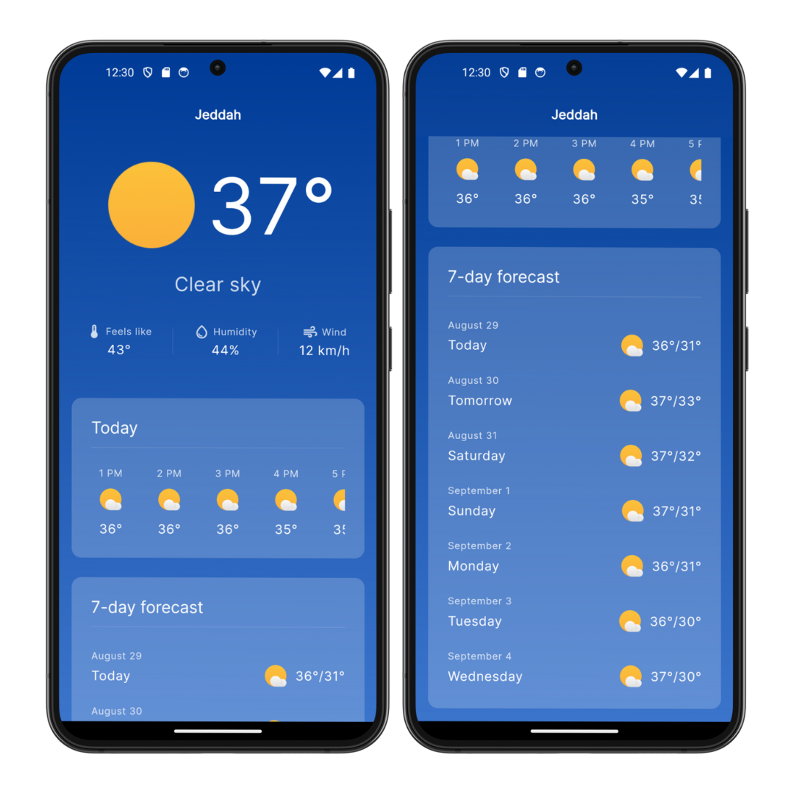
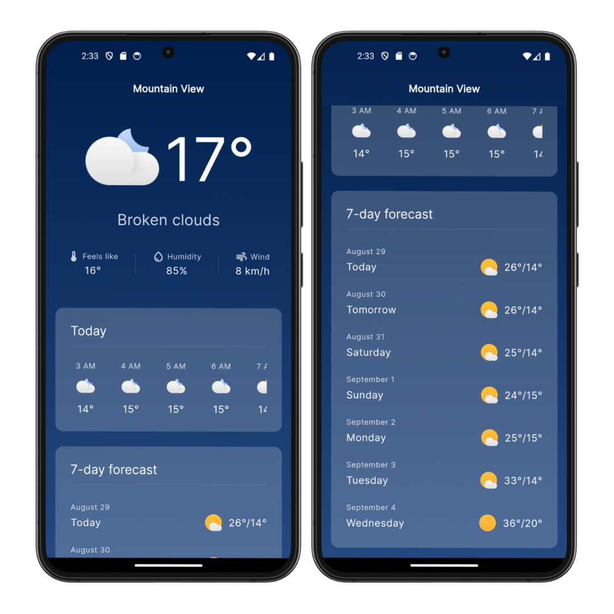

# Weather App

This is a weather app made with Flutter and [Weatherbit](https://www.weatherbit.io/) API.

## Screenshots



## Features
- **Location Detection:** Automatically detects and shows weather data for your current location.
- **Current Weather:** Provides the current temperature, weather condition, humidity level, and wind speed.
- **Hourly Forecast:** Offers an hourly forecast for the next 24 hours.
- **Daily Forecast:** Displays a daily forecast for the next 7 days.

## App Architecture
The app follows the MVVM (Model-View-ViewModel) architecture.

## State Management
[Riverpod](https://riverpod.dev/) is used for state management and API calls.

## Installation
1. Clone the repository using this command:
  ```git
  git clone https://github.com/AbeerAlshalawi/weather-app.git
  ``` 
2. Create a `.env` file by adding the following line:
  ```
  API_KEY = 'your_key'
  ```

## Attribution
The weather icons used are [Weather Now icons](https://github.com/Grabstertv/WeatherNowIcons/tree/main) by [Grabstertv](https://github.com/Grabstertv/)
